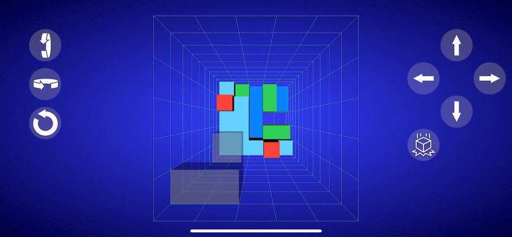

# Cuberis

Clone of Blockout '3D Tetris' game for iOS\
Written using SceneKit and Swift

## Under construction

## TODO

### First phase

* Add some sounds
* Leaderboard

### Second phase

* "Button" auto-repeat
* Haptic feedback
* Small movements of pin based on gyro
* Move camera to view set of polycubes selected in settings
* Demo mode on start scene
