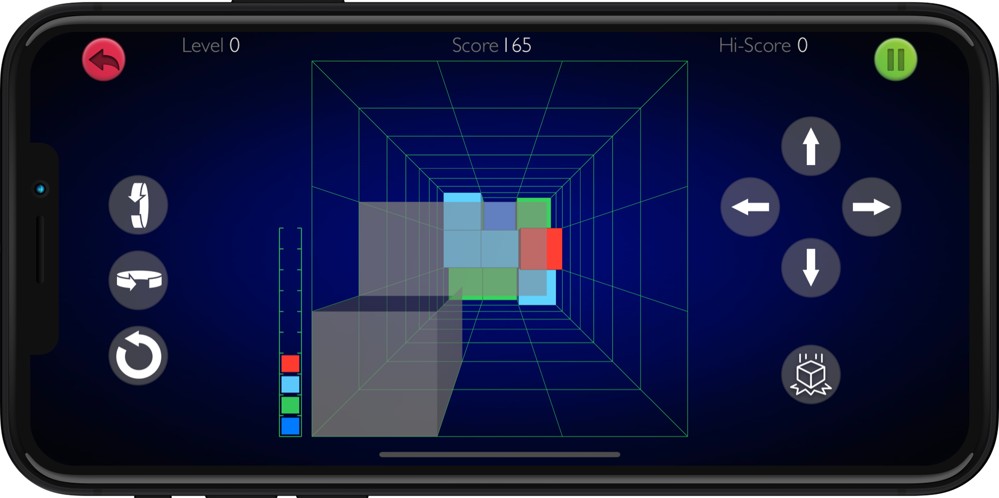

# Remake of 3D Tetris aka Blockout

The aim is to solve a real-time packing problem by forming complete rows, which then disappear and score points. Poor play leads to incomplete rows, caused by inefficient arrangements of tiles; these rows do not disappear, giving the player progressively less space and less time to play subsequent pieces. Player manipulates a set of polycubes which fall into a three-dimensional pit (seen from above; the pieces appear in the foreground and fall away). The pieces can be rotated around all three axes, and moved horizontally and vertically. The aim is to form complete layers.

## Privacy Policy

### Overview
This Privacy Policy describes how your personal information is handled in Polycuberis for iOS.

### What Personal Information do we Collect?
Registration information(optional): including (but not limited to) username, password, email, first name, last name. You are not required to register for an account or to provide any personal information to us in order to use this Service.

### Information Security
Authors of Polycuberis takes appropriate security measures to protect against unauthorized access to or unauthorized alteration, disclosure or destruction of data.

### Sharing Your Information
Authors of Polycuberis only shares your information with others in the following circumstances:

As described above.
As required by law enforcement agencies.
As we, in our sole judgment, deem necessary to investigate a breach of security.

### Contact Us
If you have any questions about this Privacy Policy, feel free to get in touch with us at vorobyov.alexey@gmail.com
